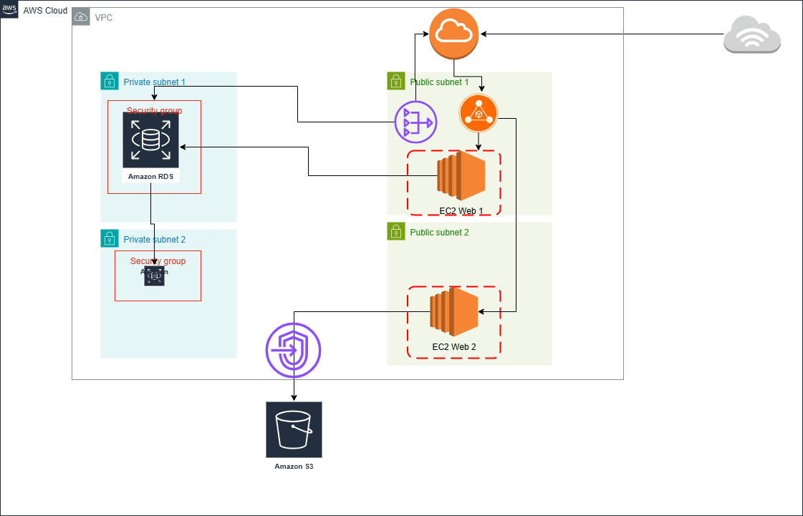

# AWS Multi-Tier Terraform (Public Web Tier)

Provision a simple, production-ish **web tier on AWS**:
- Internet-facing **Application Load Balancer (ALB)**
- **EC2 web/app instances** (Auto Scaling) in **public subnets** (but only reachable via the ALB)
- **RDS** in **private subnets**
- **S3** for logs/assets
- Optional **Route53 + ACM** for custom domain + HTTPS

---

## Architecture

**Flow**
1. Clients → **ALB** (HTTP/HTTPS).
2. ALB → **EC2** (HTTP/HTTPS). EC2 SG only trusts the ALB SG.
3. EC2 → **RDS** (DB port only). RDS is private (no public access).
4. (Optional) ALB → S3 for **access logs**; app/backup → S3 for assets.

**Security groups (minimal changes)**
- **alb_sg**: allow `80/443` from the internet.
- **app_sg** (EC2): allow `80/443` **only from alb_sg**; (SSH disabled or restricted to your IP; prefer SSM).
- **db_sg**: allow DB port **only from app_sg**.

**Health checks**
- Target group path: `/health`
- Matcher: `200–399`

---

## 📁 Repo Structure

